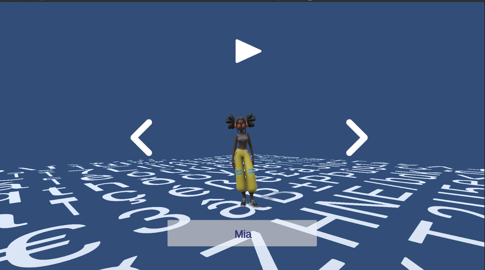
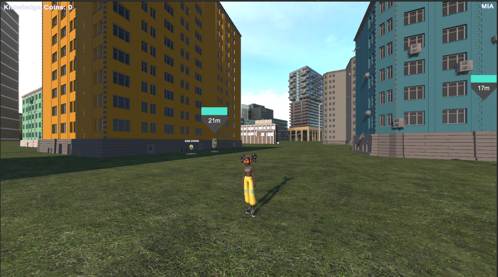
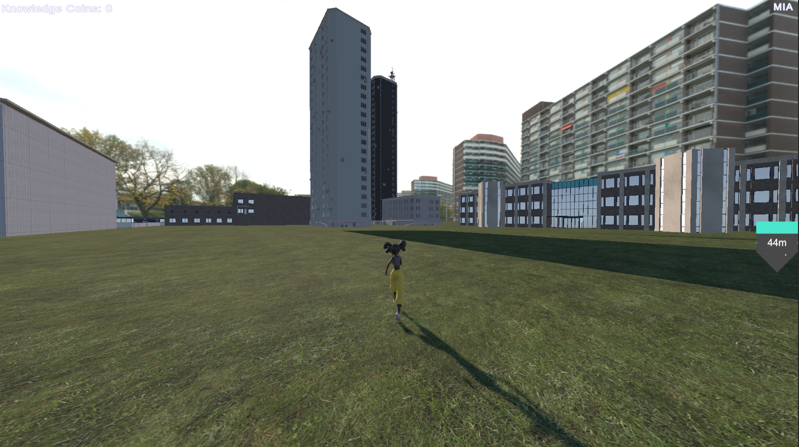
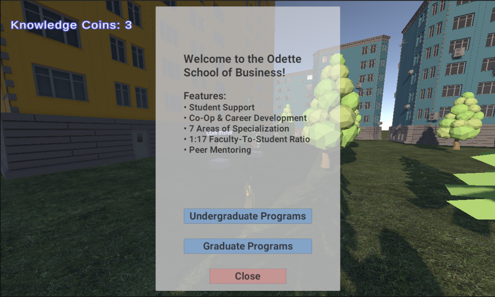
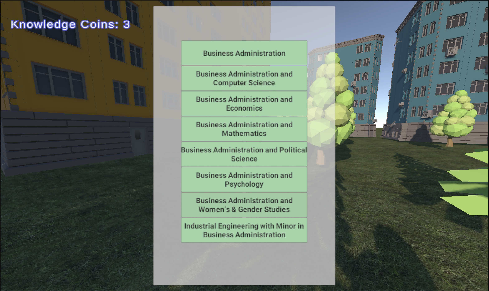
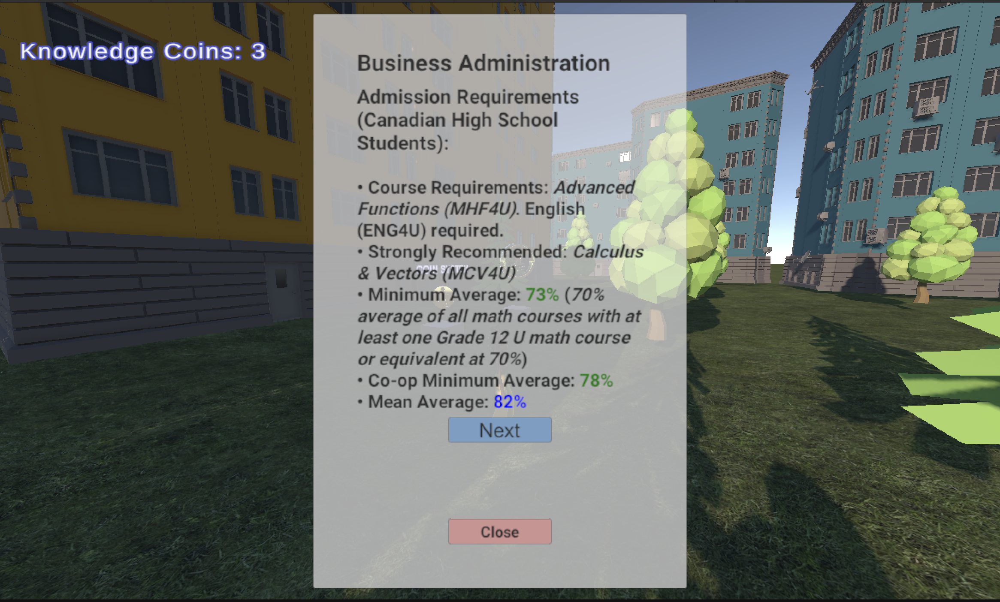

# 🎓 UWindsor Tours

**UWindsor Tours** is an interactive 3D WebGL experience where players explore a virtual University of Windsor campus in a fun and engaging way.

---

## 🌐 Live Links

- 🎮 **Demo (Itch.io)**: [UWindsor Tours Demo](https://tonidevpro.itch.io/uwindsor-tour?secret=PWEZpLm790tlPgJxXSffQpbkIIk/) *(Private Preview)*
- 🔗 **GitHub Repository**: [UWindsor_Tours on GitHub](https://github.com/tonidevvn/UWindsor_Tours)
- 🌟 **Landing Page**: [uwindsor-tours.vercel.app](https://uwindsor-tours-landing-page-b37u.vercel.app/)

---

## 🎮 Features

🧍‍♂️ **Choose Your Character**  
Pick from a set of diverse student avatars before beginning your adventure.

📍 **Navigate the Campus**  
Walk through a beautifully stylized campus environment, discover key landmarks, and find hidden quiz coins along the way.

🧠 **Collect Quiz Items**  
Test your knowledge and unlock fun facts about the university by collecting quiz coins scattered around the map.

🎧 **Immersive Audio**  
Experience dynamic background music and sound effects that respond to your actions — from footsteps to quiz interactions.

⚙️ **Customizable Settings**  
Adjust your graphics quality, sound volumes, and screen settings via the intuitive settings menu — even in-game!

⏸️ **Pause & Resume Freely**  
Need a break during your tour? Use the pause menu to resume, adjust settings, or return to the main menu anytime.

---

## ⚛ Technologies

- Unity + C# (Game Logic, UI Systems, Player Control)
- UI Toolkit (Unity’s modern UI system)
- WebGL Deployment (Hosted on Itch.io or Github Pages)
- TailwindCSS + TypeScript (for Landing Page)

## 🛠️ Tools

- Unity 6000.0.44f1 (WebGL Build)
- VS Code 1.98

---

## 👥 Credits

- **Product Owner**: Simon Du Toit – Undergraduate Student Recruitment Officer  
- **Faculty Supervisor**: Aznam Yacoub – Faculty Advisor

> Developed by a passionate team of students at the University of Windsor.

## 🖼️ Screenshots

- 
- 
- 
- 
- 
- 

## Backup resources

Assets/Game/Environment .blend files
[Blender file](https://drive.google.com/drive/folders/1yXsn3EEDhcZ6BMIfWb32tc2a6ITzgzUg?usp=sharing)